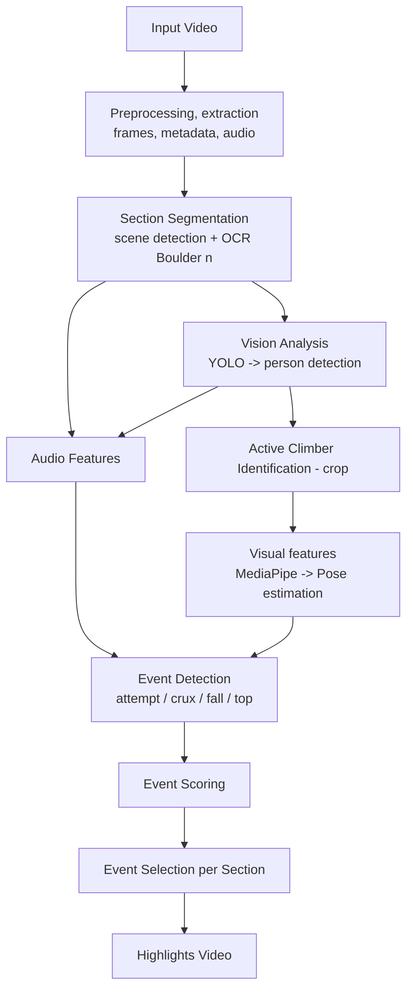

# bouldering-highlights

An **end-to-end AI pipeline** to automatically create **highlights** from Bouldering competition videos.

This project combines:
- **Computer vision** (Person detection, tracking, pose estimation)
- **OCR-based segmentation**
- **Audio event detection** (audio signal processing + Classification using YAMnet)
- **Visual Feature extraction** 
- **Heuristic event rules**
- **Replay detection (optional)**
- **Event scoring & selection**

## 📦 Features

- Detects Bouldering sections (“Boulder n”) using scene detection + OCR
- Tracks all persons, identifies the **active climber**
- Extracts pose-based kinematic features
- Analyzes the audio track for applause/cheering/shouts
- Detects key events:
  - attempts  
  - dynamic moves (crux)  
  - falls  
  - tops  
- Handles replays (optional)
- Scores events and selects the best per section
- Generates:
  - **events.json**
  - **highlights.mp4**

---

# 🧭 Pipeline Overview

