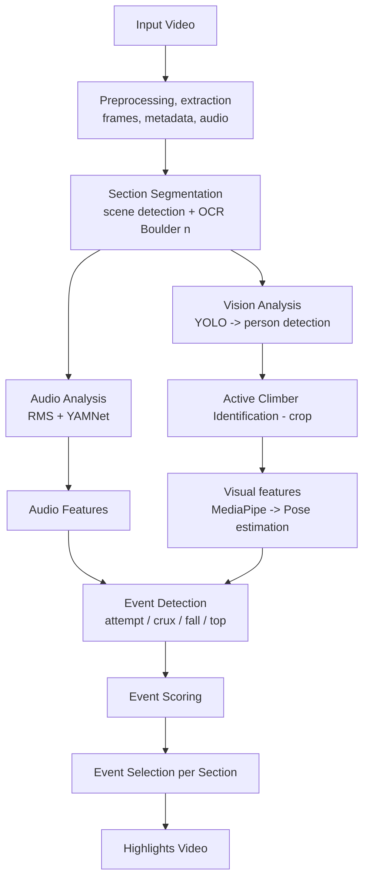

# bouldering-highlights

An **end-to-end AI pipeline** to automatically create **highlights** 
from the Bouldering Olympics 2024 competition videos.

This project intergrates pretrained Computer Vision models such as **YOLO** for person detection for example, and Image Processing techniques with rule based logic to identify key events.

For this first version of the project, no model training or fine-tuning is performed. Person detection or pose estimations are already well knwon and developed fields and pretrained models are sufficiently performant and robust.

System rules and numeric parameters are derived from an example video.
However, as with any ML-based system, an evaluation phase is essential to validate the performance and understand the system's behavior. Custom metrics will be defined and a dedicated test video will serve as the evaluation benchmark.

Technology used:
- **Video / audio**
  - FFMPEG (read/write)
- **Visual analysis**:
  - Person detection (YOLOv11)
  - OCR-based segmentation (EasyOCR)
  - Pose estimation (MediaPipe)
- **Audio analysis**
  - sound classification (YAMNet)

---

# Highlights pipeline

