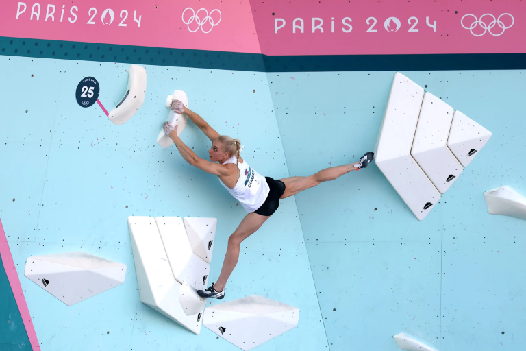
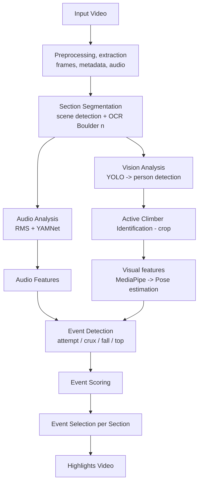

# bouldering-highlights

An **end-to-end AI pipeline** to automatically create **highlights** 
from Bouldering Olympics 2024 competition videos.

This project combines using pretrained Computer Vision models like **YOLO** for person detection for example, and Image Processing techniques with rule based conditions for event detections.

For this first version of the project, no training nor fine-tuning is made on the models because it deals with standard person / pose detection problems which are sufficiently developed and efficient.

Rules and numeric parameters of the system will be learned from a small video example.
However, like any ML system, an evaluation step must be made in order to qualify the system and control its behavior. Special metrics will be defined and a video for testing will be used to evaluate the system.

Technology used:
- **Video / audio**
  - FFMPEG (read/write)
- **Visual analysis**:
  - Person detection (YOLOv11)
  - OCR-based segmentation (EasyOCR)
  - Pose estimation (MediaPipe)
- **Audio analysis**
  - sound classification (YAMNet)

---

# Highlights pipeline

